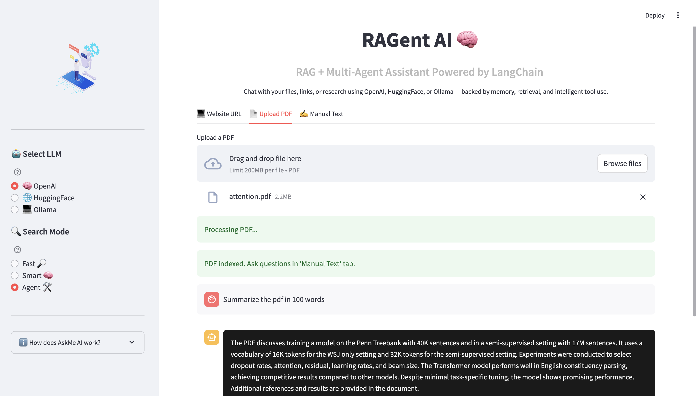
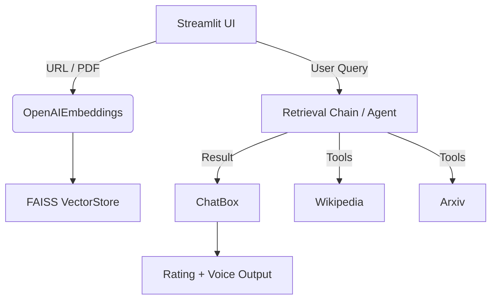

# 🤖 RAGent AI — Retrieval-Augmented Multi-Agent Assistant

RAGent AI is a powerful, visually polished chatbot powered by **LangChain**, designed for **RAG (Retrieval-Augmented Generation)** and **Multi-Agent** workflows. With support for **OpenAI**, **HuggingFace**, and **Ollama** LLMs, it's your go-to assistant for document Q&A, semantic search, summarization, and beyond — all with a beautiful Streamlit interface.

---

## ✨ Features

| Capability                  | Description                                                                 |
|----------------------------|-----------------------------------------------------------------------------|
| 🧠 **Multi-LLM**            | Choose from OpenAI, HuggingFace, or Ollama with live toggle                 |
| 📎 **RAG-Enabled**          | Retrieval-Augmented Generation from PDF or website                         |
| 🧠 **Memory Support**       | Uses LangChain memory for contextual follow-up conversations               |
| 🎤 **Voice I/O**            | Ask questions via microphone, hear answers back (TTS)                      |
| 🛠️ **Multi-Agent Mode**     | Run Wikipedia, Arxiv & RAG search via LangChain agents                     |
| ⭐ **Feedback Capture**      | Built-in response rating (👍/👎) for improvement                            |
| 🌑 **Dark Mode + UI Polish**| Enhanced with tooltips, icons, banners, dark UI, and UX animations         |

---

## 🖼️ UI Snapshot

 <!-- Add screenshot in /docs or change path -->

---

## 🛠️ Architecture

---

🔧 Prerequisites
Python 3.11+
OpenAI API Key
HuggingFace Token
(Optional) Ollama Installed

🧪 Installation
git clone https://github.com/nishad2725/RAGent-AI.git
cd RAGent-AI

# Create virtual environment
python3 -m venv .venv
source .venv/bin/activate

# Install dependencies
pip install -r requirements.txt

# Add secrets to .env
touch .env

.env sample:
OPENAI_API_KEY="your-openai-key"
HUGGINGFACEHUB_API_TOKEN="your-hf-token"
LANGCHAIN_API_KEY="your-langchain-key"

▶️ Run the App
streamlit run chatbot/app.py

🤝 Contributing
Pull requests are welcome! Open issues for feedback or improvements.
